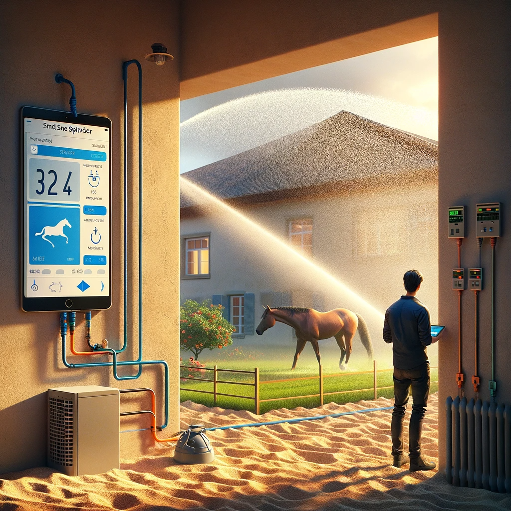
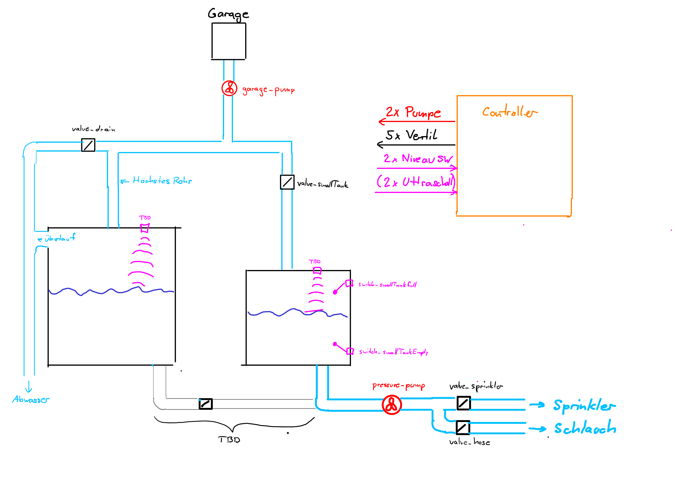
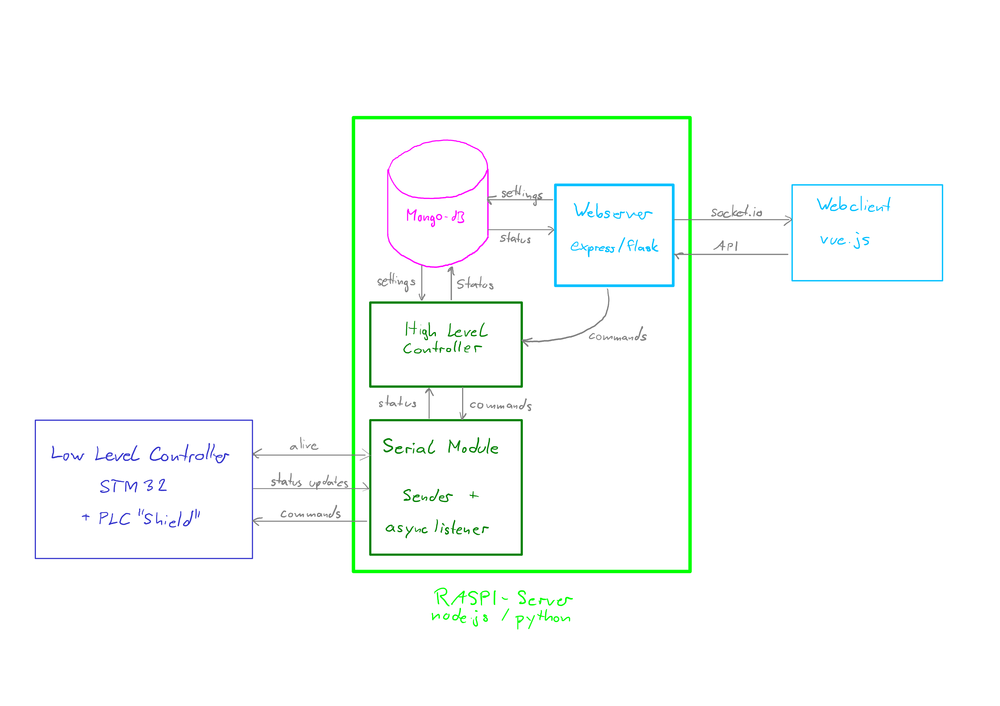

# sand-square-sprinkler
System to control water sprinklers and manage the water reservoir.

## Table of Contents
- [sand-square-sprinkler](#sand-square-sprinkler)
  - [Table of Contents](#table-of-contents)
  - [System Overview](#system-overview)
  - [Controller Block Diagram](#controller-block-diagram)
  - [Responsibilities](#responsibilities)
  - [ToDo](#todo)
    - [STM](#stm)
    - [Raspi - Server](#raspi---server)
    - [Webclient](#webclient)
  - [Requirements](#requirements)
    - [GUI](#gui)

## System Overview

## Controller Block Diagram

## Responsibilities
**Bachmann**
- Webclient
  
**Burger**
- Low Level Controller (STM32)
- Webserver

## ToDo
### STM
- Additional features..

### Raspi - Server
- Make client webpage available via server
- Implement database to store logs

### Webclient
- Draft

## Requirements
### GUI
**Controls**
- Garage Pump On/Off
- Fill tank: Small/Large/none
- Sprinkler On/Off
- Hose On/Off
- Sprinkler On [for x Minutes]

**Status**
- Garage pump status
- Fill tank status
- Sprinkler status
- Hose status

**Visual System Overview**
- Optional: Display a visual overview of the System with all pumps, valves and level switches

**Diverse**
- Alive signal
