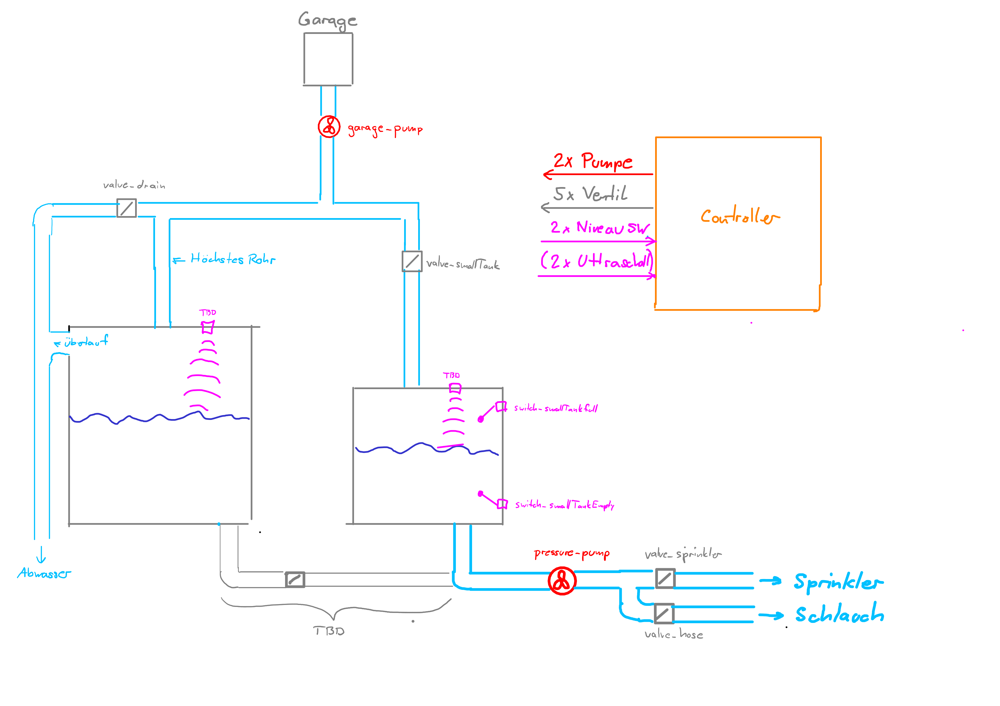
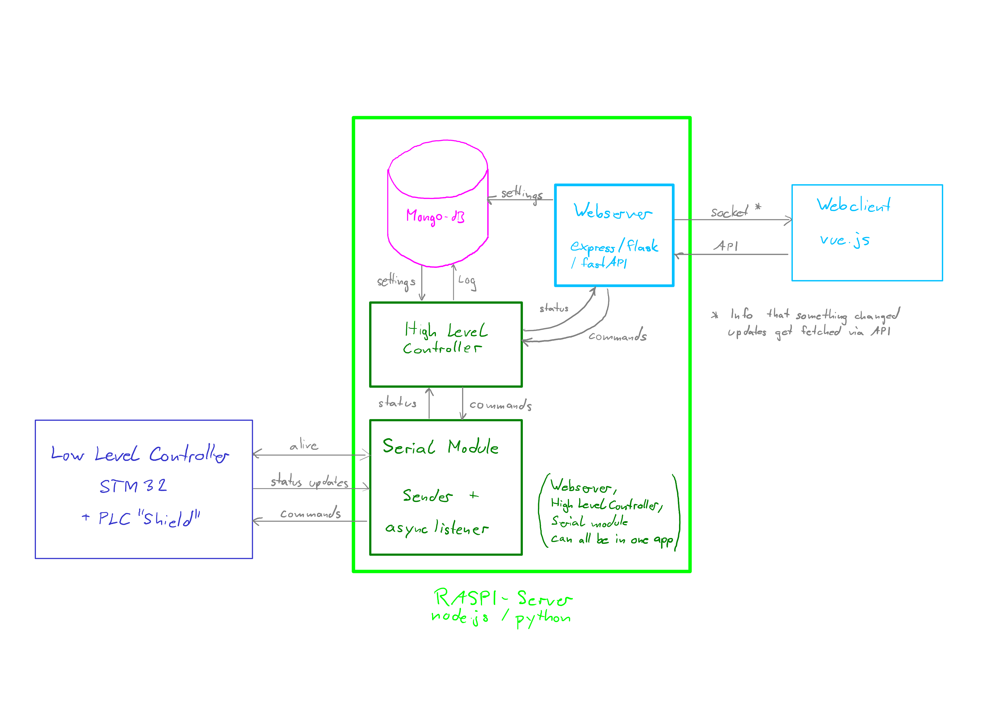
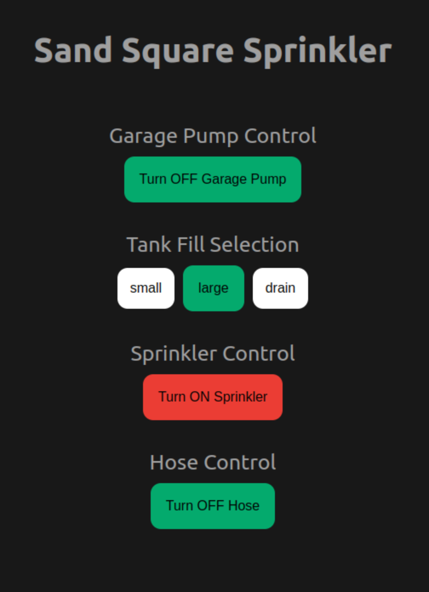

# sand-square-sprinkler
System to control water sprinklers and manage the water reservoir.

## Table of Contents
- [sand-square-sprinkler](#sand-square-sprinkler)
  - [Abstract](#abstract)
  - [Table of Contents](#table-of-contents)
  - [System Overview](#system-overview)
  - [Controller Block Diagram](#controller-block-diagram)
  - [API Endpoints](#api-endpionts)
  - [Client](#client)
  - [Install Guide](#install-guide)
 
## Abstract
Das Projekt Sand Square Spinkler ist eine Regenwassersteurerung. Ein STM32 Board stuerert alle Pumpen und Ventile an. Gesteuert wird alles mit einer Web Applikation die auf einem Raspberry Pi lauft und direkt mit dem STM32 Board verbunden ist.

## System Overview

## Controller Block Diagram

## API Endpionts
TODO beschreinug der API Endpionts

## Client

Die Vue App hat für jede Pumpenstuereung ein eigenes Component. Die Garagen-, Sprinkler- und Schlauchsteurung ist ein einzelner Button, welcher den aktuellen Status toggelt und posted diesen. Bei der Tank Fill Component haben wir drei Buttons um auszuwählen welcher Tank gefüllt werden soll und dieser wird in der API hinterlegt. Über einen Socket wird die Verbindung mit der API hergestellt. Gibt es einen Status änderung werden die einzelnen Components automatisch geupdated und gegebenfalls die Buttons gändert. Die Buttons zeigen den aktuellen Status an und werden erst geändert wenn sich der Status in der API ändert und nicht direkt beim klicken.

## Install Guide
TODO Erklärung Inbetriebnahme