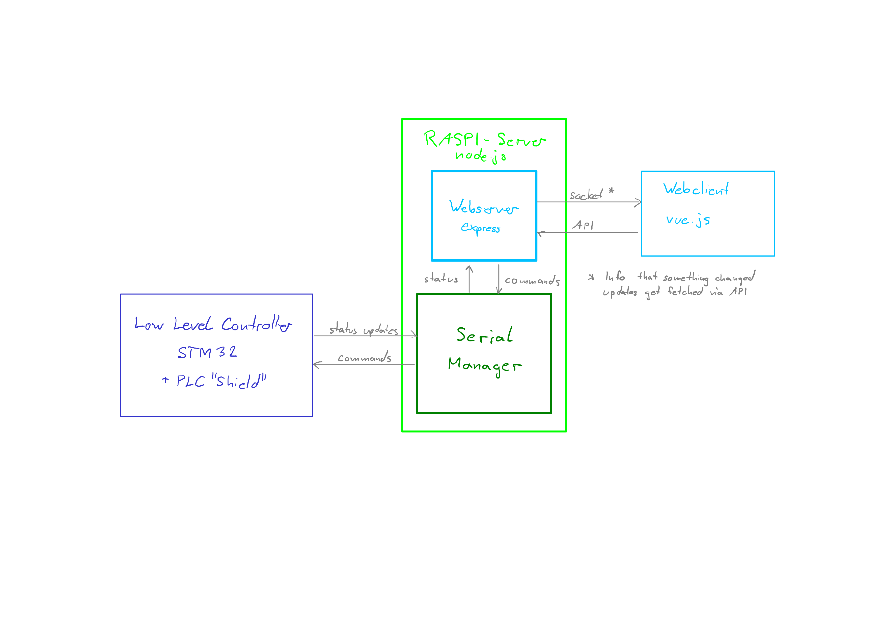

# sand-square-sprinkler


## Table of Contents
- [sand-square-sprinkler](#sand-square-sprinkler)
  - [Table of Contents](#table-of-contents)
  - [Abstract](#abstract)
  - [Low Level Controller (STM32)](#low-level-controller-stm32)
  - [Controller Block Diagram](#controller-block-diagram)
  - [Serial Interface](#serial-interface)
    - [`GARAGE_PUMP_START`](#garage_pump_start)
    - [`GARAGE_PUMP_STOP`](#garage_pump_stop)
    - [`FILL_LARGE_TANK`](#fill_large_tank)
    - [`FILL_SMALL_TANK`](#fill_small_tank)
    - [`FILL_NO_TANK`](#fill_no_tank)
    - [`SPRINKLER_START`](#sprinkler_start)
    - [`SPRINKLER_STOP`](#sprinkler_stop)
    - [`HOSE_START`](#hose_start)
    - [`HOSE_STOP`](#hose_stop)
    - [`GET_STATUS_ALL`](#get_status_all)
    - [`ERROR_UNKNOWN_CMD`](#error_unknown_cmd)
  - [API Endpoints](#api-endpoints)
    - [POST /sss/api/control/garage-pump](#post-sssapicontrolgarage-pump)
    - [POST /sss/api/control//tank](#post-sssapicontroltank)
    - [POST /sss/api/control//hose](#post-sssapicontrolhose)
    - [POST /sss/api/control/sprinkler](#post-sssapicontrolsprinkler)
    - [GET /sss/api/status](#get-sssapistatus)
  - [Client](#client)
  - [Install Guide](#install-guide)
 
## Abstract
Das Projekt Sand Square Spinkler ist eine Sprinkler- und Regenwassersteurerung. Ein STM32 Board stuerert alle Pumpen und Ventile an. Gesteuert wird alles mit einer Web Applikation die auf einem Raspberry Pi lauft und direkt mit dem STM32 Board verbunden ist.

## Low Level Controller (STM32)
Die Pumpen und Ventile der Anlagen werden von einem STM32 Mikrocontroller mit PLC-Shield angesteuert. Durch verschiedene State-Machines wird sichergestellt, dass sich die Anlage immer in einem sicheren Zustand befindet, dadurch sind die Pumpen vor trockenlaufen und die Tanks vor dem Überlaufen geschützt.

## Controller Block Diagram
Der STM32 ist über einen Serial Port mit dem Raspberry Pi verbunden. Auf dem Raspberry Pi läuft eine node.js Applikation. Der Serial-Manager regelt die Kommunikation zum STM, wobei ein temporärer Ausfall des Com-Ports abgefangen wird. Ein express.js Server stellt API-Endpoints zur Verfügung und hostet die Client Webpage statisch. Der Client wird über ein Websocket informiert, wenn neue Daten vorliegen. Der Client holt sich dann die entsprechenden Daten über die API. 


## Serial Interface
Der Server interagiert über serielle Befehle mit dem Mikrocontroller. Nachfolgend sind alle möglichen Befehle aufgelistet:

### `GARAGE_PUMP_START`
- **Funktion**: Startet die Garagenpumpe.
- **Erwartete Antwort**: `GARAGE_PUMP_RUNNING`

### `GARAGE_PUMP_STOP`
- **Funktion**: Stoppt die Garagenpumpe.
- **Erwartete Antwort**: `GARAGE_PUMP_STOPPED`

### `FILL_LARGE_TANK`
- **Funktion**: Wählt den großen Wassertank.
- **Erwartete Antwort**: `LARGE_TANK_SELECTED`

### `FILL_SMALL_TANK`
- **Funktion**: Wählt den kleinen Wassertank.
- **Erwartete Antwort**: `SMALL_TANK_SELECTED`

### `FILL_NO_TANK`
- **Funktion**: Wählt keinen Wassertank.
- **Erwartete Antwort**: `NO_TANK_SELECTED`

### `SPRINKLER_START`
- **Funktion**: Aktiviert das Sprinklersystem.
- **Erwartete Antwort**: `SPRINKLER_RUNNING`

### `SPRINKLER_STOP`
- **Funktion**: Deaktiviert das Sprinklersystem.
- **Erwartete Antwort**: `SPRINKLER_STOPPED`

### `HOSE_START`
- **Funktion**: Startet den Schlauch.
- **Erwartete Antwort**: `HOSE_RUNNING`

### `HOSE_STOP`
- **Funktion**: Stoppt den Schlauch.
- **Erwartete Antwort**: `HOSE_STOPPED`

### `GET_STATUS_ALL`
- **Funktion**: Fordert den aktuellen Status aller Komponenten an.
- **Erwartete Antworten**: Verschiedene Statusmeldungen je nach Komponente.

### `ERROR_UNKNOWN_CMD`
- **Funktion**: Meldet einen unbekannten oder ungültigen Befehl.
- **Erwartete Antwort**: Keine spezifische Antwort; wird im Fehlerprotokoll aufgezeichnet.

## API Endpoints

Dieser Abschnitt beschreibt die verfügbaren API-Endpunkte zur Steuerung und Überwachung verschiedener Komponenten des Heimautomatisierungssystems.

### POST /sss/api/control/garage-pump
Steuerung der Garagenpumpe.
- **Body-Parameter:**
  - `state`: 'on' | 'off'
- **Antworten:**
  - `200 OK`: Befehl erfolgreich gesendet.
  - `500 Interner Serverfehler`: Unbekannter Wert.

### POST /sss/api/control//tank
Wählt aus, welcher Wassertank gefüllt werden soll.
- **Body-Parameter:**
  - `select`: 'small' | 'large' | 'none'
- **Antworten:**
  - `200 OK`: Befehl erfolgreich gesendet.
  - `500 Interner Serverfehler`: Unbekannter Wert.

### POST /sss/api/control//hose
Steuerung des Wasserschlauches.
- **Body-Parameter:**
  - `state`: 'on' | 'off'
- **Antworten:**
  - `200 OK`: Befehl erfolgreich gesendet.
  - `500 Interner Serverfehler`: Unbekannter Wert.

### POST /sss/api/control/sprinkler
Steuerung des Sprinklersystems.
- **Body-Parameter:**
  - `state`: 'on' | 'off'
- **Antworten:**
  - `200 OK`: Befehl erfolgreich gesendet.
  - `500 Interner Serverfehler`: Unbekannter Wert.

### GET /sss/api/status
Ruft den aktuellen Status aller Komponenten ab.
- **Antwort:**
  - `200 OK`: JSON-Objekt mit dem Status jeder Komponente.
    ```json
    {
      "garagePump": "off",
      "tankSelect": "large",
      "sprinkler": "on",
      "hose": "off"
    }
    ```


## Client


Die Vue App hat für jede Pumpenstuereung ein eigenes Component. Die Garagen-, Sprinkler- und Schlauchsteurung ist ein einzelner Button, welcher den aktuellen Status toggelt und posted diesen. Bei der Tank Fill Component haben wir drei Buttons um auszuwählen welcher Tank gefüllt werden soll und dieser wird in der API hinterlegt. Über einen Socket wird die Verbindung mit der API hergestellt. Gibt es einen Status änderung werden die einzelnen Components automatisch geupdated und gegebenfalls die Buttons gändert. Die Buttons zeigen den aktuellen Status an und werden erst geändert wenn sich der Status in der API ändert und nicht direkt beim klicken.

## Install Guide
**Mikrocontroller Software**
- Projekt im Ordner STM32 mit STM32CubeIDE öffnen
- NUCLEO-F411RE Board per USB-Kabel mit PC verbinden
- Software mit RUN Button auf Mikrocontroller laden
  
**Hardware**
- X-NUCLEO-PLC01A1 auf NUCLEO-F411RE Board aufstecken
- X-NUCLEO-PLC01A1 mit 24V versorgen
- NUCLEO-F411RE per USB Kabel mit Raspberry-Pi (oder anderer Linux Computer) verbinden

**Linux Server**
- Dieses Repository klonen
- Im Repository folgende befehle ausführen:
  

``` bash
sudo apt install npm
```
``` bash
cd server
```
Installiert node package manager.
``` bash
npm install
```
Installiert alle für den Server nötigen node packages.
``` bash
sudo npm install -g pm2
```
Installiert PM2 global auf dem System.
``` bash
pm2 start ./server.js --name "sand-square-sprinkler"
```
Startet den Server mit PM2.
``` bash
pm2 save
```
Speichert die aktuelle PM2 Konfiguration.
``` bash
pm2 startup
```
Erstellt automatisch ein Startup Script, womit die zuvor gespeicherte Konfiguration beim Neustart gestartet wird.
``` bash
sudo env PATH=$PATH:/usr/bin /usr/local/lib/node_modules/pm2/bin/pm2 startup systemd -u pi --hp /home/pi
```
Fügt das soeben erstellte Startup Script dem System hinzu.

Damit sollte die Webpage unter "server-ip":3000 verfügbar sein.